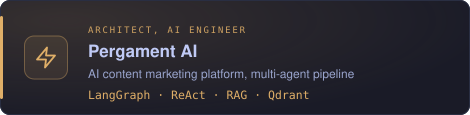
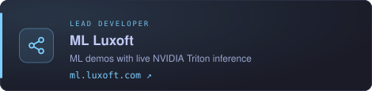
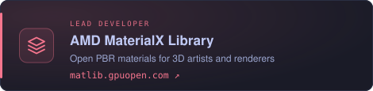
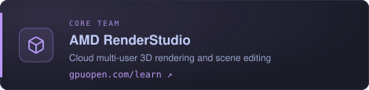
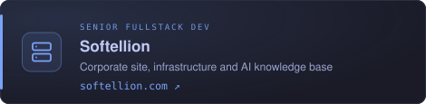

# Hi, I'm Evgeny Gurin

AI Engineer / Senior Fullstack Developer · 7+ years · PhD student in Computer Science at ITMO University

`Python` `FastAPI` `Vue.js` `LangGraph` `RAG` `Qdrant` `Kubernetes` `AWS`

- Author of ITMO's DevOps course

<table>
  <tr>
    <td width="50%"></td>
    <td width="50%"></td>
  </tr>
  <tr>
    <td></td>
    <td></td>
  </tr>
  <tr>
    <td></td>
    <td></td>
  </tr>
</table>

### Contacts
[][vk]
[][telegram]
[][email]

[vk]: https://vk.com/guldilin
[telegram]: https://t.me/evgeny_gurin
[email]: mailto:zhenyagurin@gmail.com
